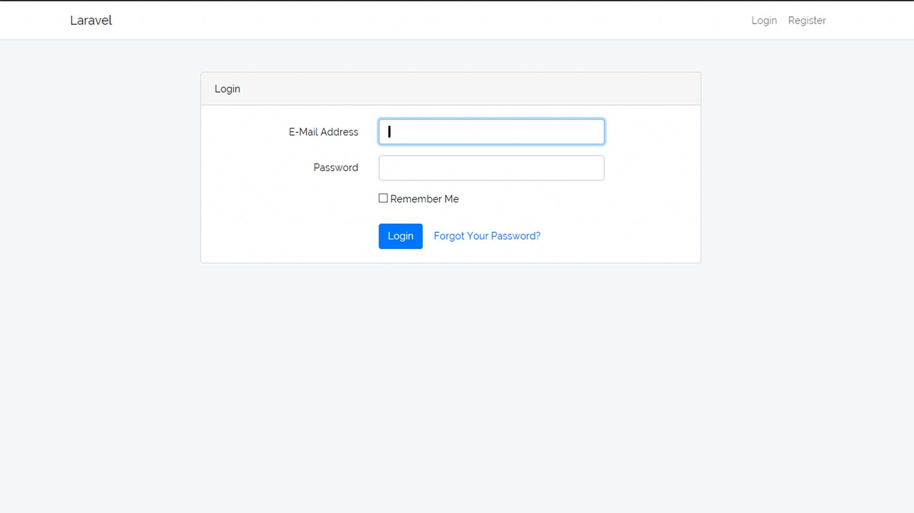
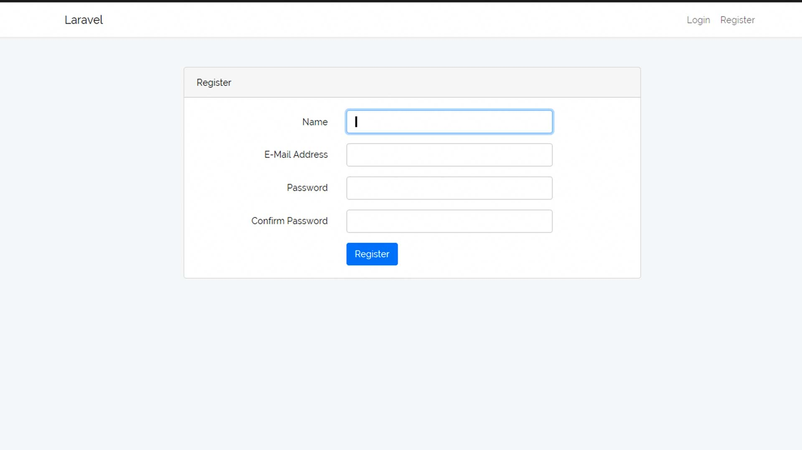
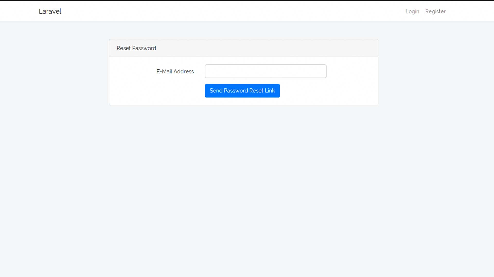
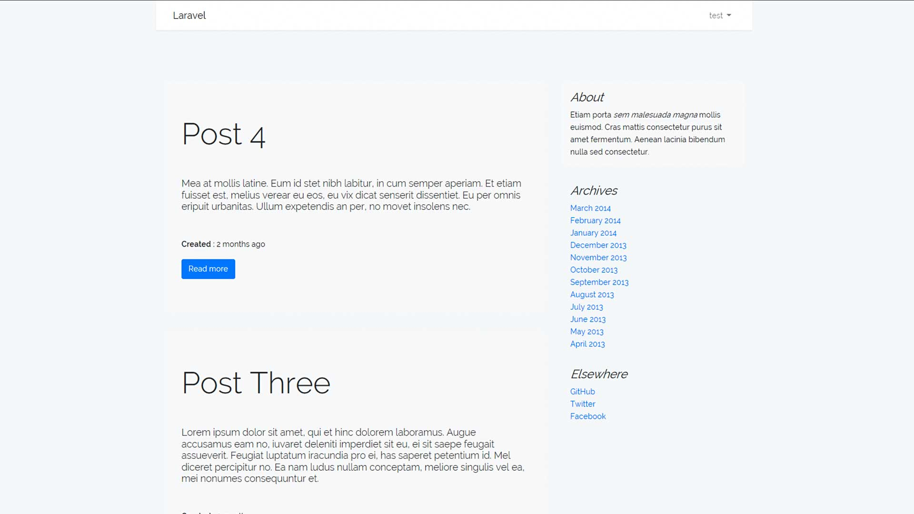
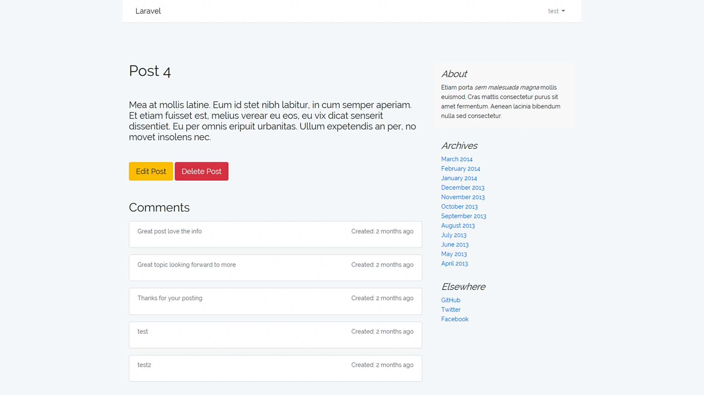

## Laravel CRUD Project

```
> git clone
> cd Blog
> start WAMP server / sql database or alternative
> composer install
> php artisan serve

```

### KEY FEATURES

> Auth / Login / Password Reset

> Guarding

> CRUD application

> Eloquent

> Blade templating

> Dashboard intergration

> Laravel Collective Forms

> Comments section


### IMPORTANT

> Install dependencies

> Create a named database and edit .env file to facilitate database connection 

> Ensure you migrate to your database -  php artisan migrate

> Create a new user so you can login to the application


## Screen Shots





